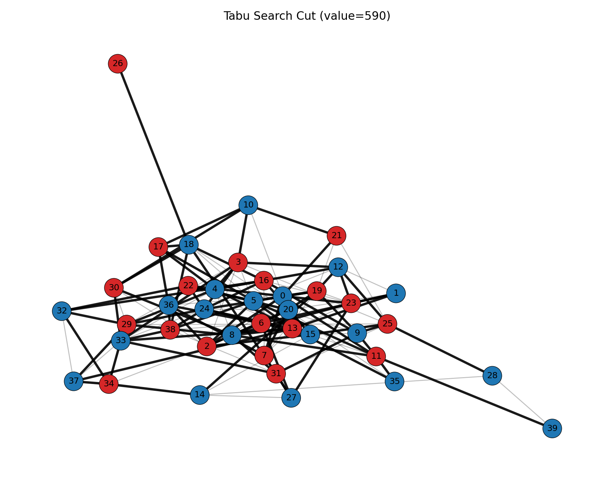
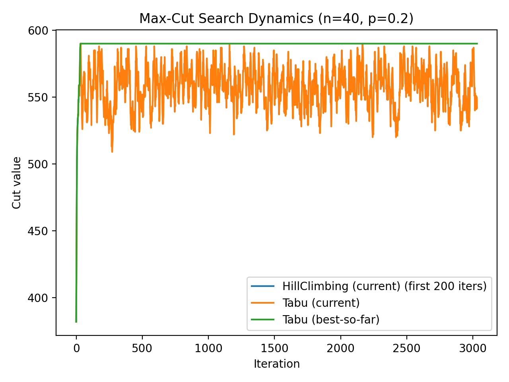
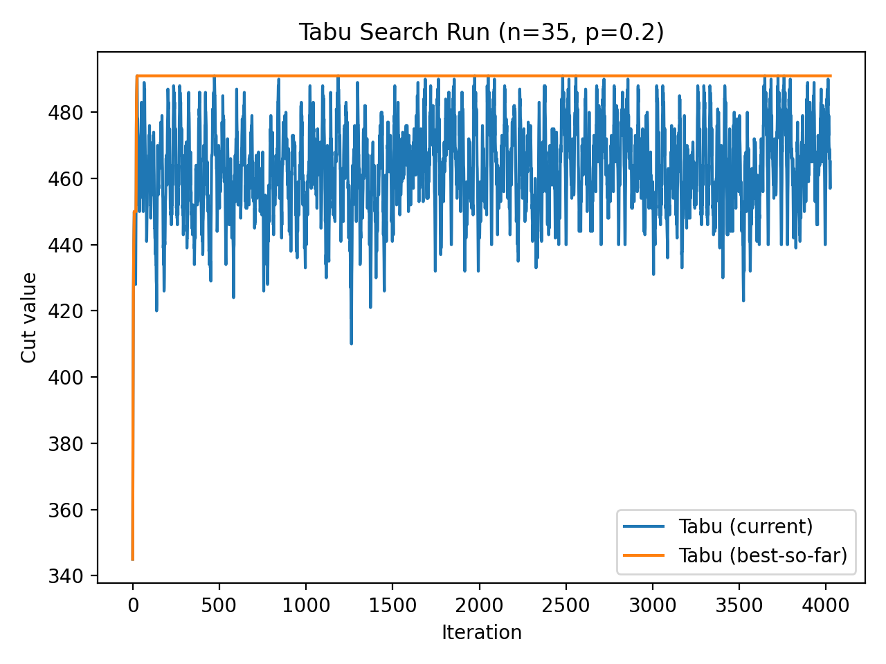
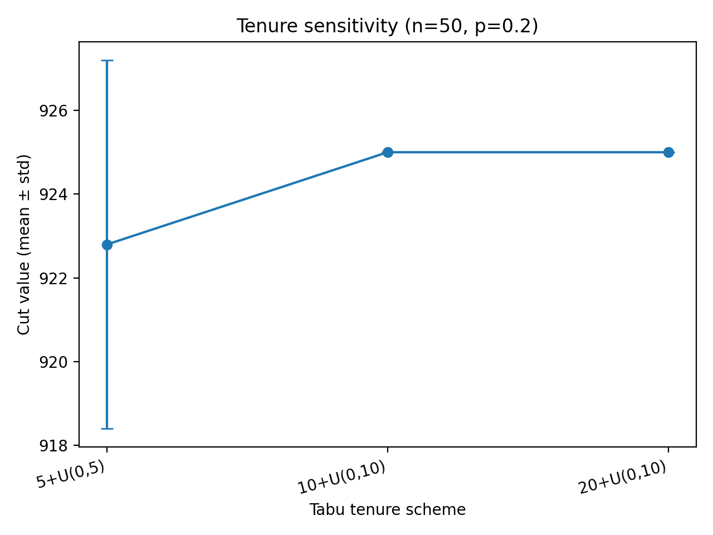
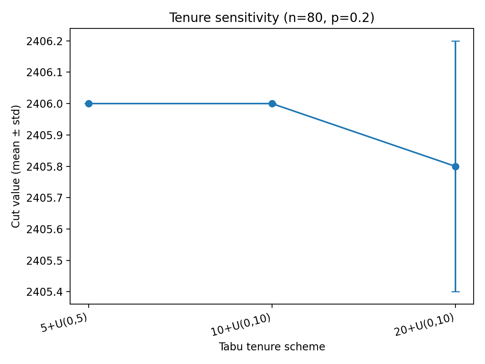
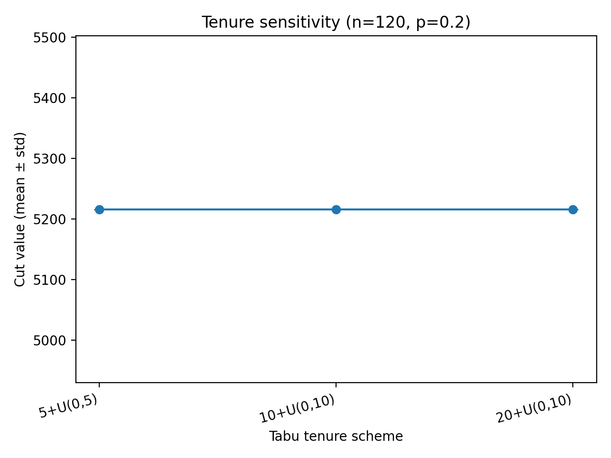
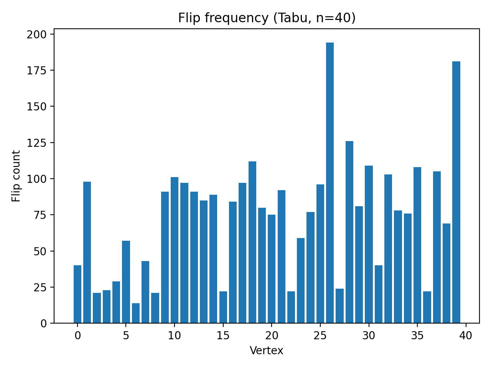

# Max-Cut Problem Solved Using Tabu Search Metaheuristic

This repository contains a complete implementation and experimental evaluation of a **Tabu Search metaheuristic** for solving the **Maximum Cut (Max-Cut) problem**, a classical **NP-complete combinatorial optimization problem**.

The project was developed as part of the course **Algorithmic and Combinatorial Optimisation** at **Université Paris-Saclay**.

---

## Problem Description

Given an undirected weighted graph  
\( G = (V, E, w) \),  
the **Max-Cut problem** consists of partitioning the vertex set into two disjoint subsets such that the **sum of the weights of edges crossing the partition** is maximized.

Because Max-Cut is NP-complete, exact algorithms do not scale to large instances, motivating the use of **metaheuristic approaches**.

---

## Methods Implemented

The following algorithms are implemented and compared:

- **Random baseline** (best of multiple random solutions)
- **Hill Climbing** (greedy local search)
- **Tabu Search** (memory-based metaheuristic)

In addition to a standard Tabu Search, several **metaheuristic optimizations** are proposed and **evaluated experimentally**, as required in the project instructions.

---

## Solution Encoding

- Solutions are encoded as **binary vectors** \( x \in \{0,1\}^n \)
- Each bit represents the partition of a vertex
- Neighborhood: **single-vertex flips**
- Fitness: **total cut value**
- **Incremental (delta) evaluation** is used for efficiency

This encoding guarantees feasibility and is well suited for local search methods.

---

## Metaheuristic Optimizations Evaluated

- Tabu tenure sensitivity analysis  
- Candidate-list Tabu Search (Top-K promising moves)  
- Runtime vs solution quality trade-off  
- Flip-frequency analysis of vertices  
- Visualization of search dynamics and diversification  

---

## Experiments and Visualizations

All experiments are fully reproducible and generate figures automatically.

---

### Hill Climbing vs Tabu Search (Final Cuts)

**Hill Climbing (local optimum):**


Hill Climbing converges quickly but gets trapped in a local optimum.

**Tabu Search (improved solution):**



Tabu Search escapes local optima and achieves a higher cut value.

---

### Search Dynamics

**Hill Climbing vs Tabu Search evolution:**



This plot shows that Hill Climbing stagnates early, while Tabu Search continues to explore and improve the best-so-far solution.

**Single Tabu Search run:**



The oscillations highlight diversification around a stable best solution.

---

### Tabu Tenure Sensitivity

Influence of tabu tenure on solution quality:

**n = 50**



**n = 80**



**n = 120**



Results show that Tabu Search is robust to reasonable parameter variations.

---

### Search Behavior Analysis

**Flip-frequency analysis:**



This plot highlights vertices that are frequently modified during the search, providing insight into the exploration process.

---

### Animated Simulations

**Tabu Search graph evolution:**


**Synchronized graph and objective value evolution:**


These animations provide an intuitive understanding of Tabu Search dynamics.

---

## How to Run

### Requirements

```bash
pip install matplotlib networkx pillow
```
### Run all experiments and visualizations

```
python src/maxcut_tabu.py
```
